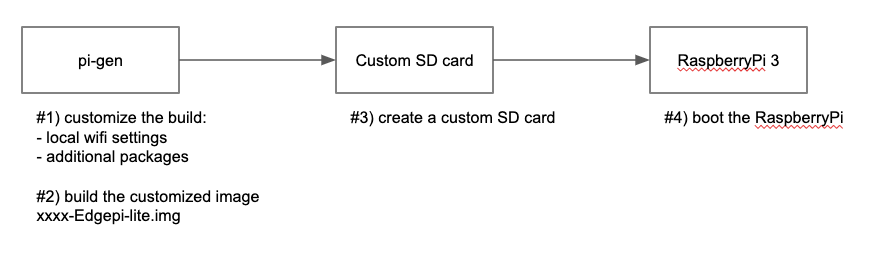
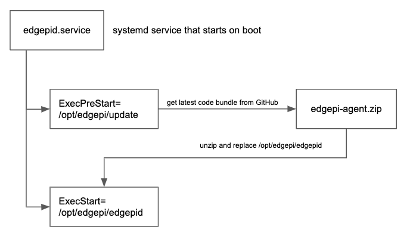

# edge-pi

A guide how to use a Raspberry Pi as an edge device and how to set it up for IoT use-cases. 

### Documentation

#### Part 1 - Manually setup your Raspberry Pi

This guide shows how to setup a Raspberry Pi, step-by-step.

See [docs/setup_raspberry.md](docs/setup_raspberry.md)

#### Part 2 - Create a custom boot image

TBD

#### Part 3 - The EdgePi Boot Process

TBD
